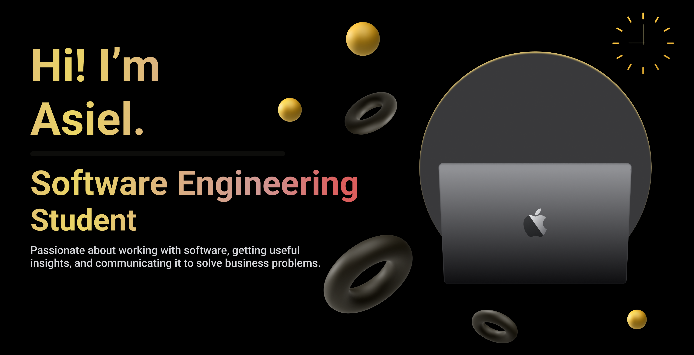

I am a first-year student at Inholland University in Software Engeneering, and I'm passionate about technology, coding, and continuous learning. Welcome to my GitHub profile where you'll find a collection of my projects, contributions, and experiments in the world of software development.

 

## About Me

-  Currently pursuing my Bachelor's degree in IT at Inholland University.
-  Always eager to learn new technologies and improve my coding skills.
-  I document my learning journey, projects, and thoughts on my [website](https://asiel-elaouare.com), where you can find insightful blogs and detailed learning paths.

  

 
## My Toolbox

 

 

## My Website
Here you'll find my blogs, learning paths, and projects that show my journey and skills in the tech world. Come along as I learn and grow in IT. [asiel-elaouare.com ](https://asiel-elaouare.com)

